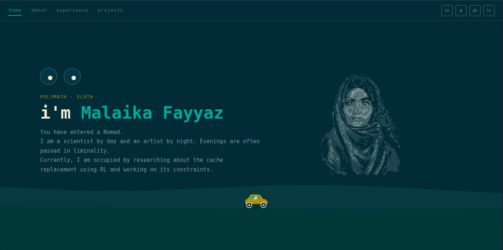
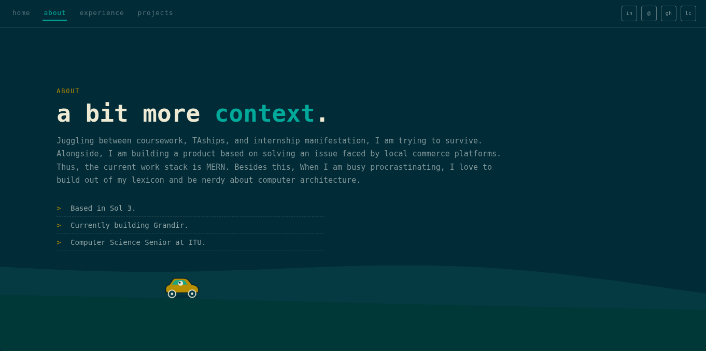
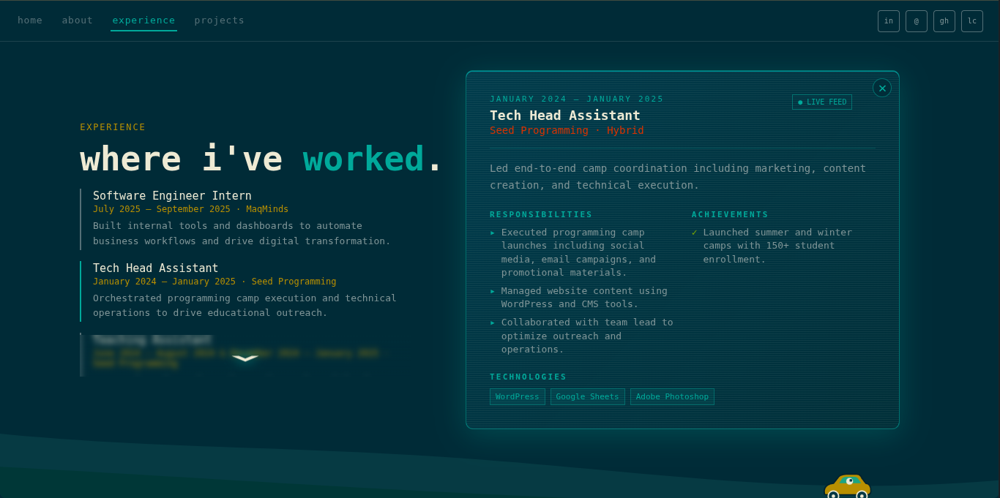
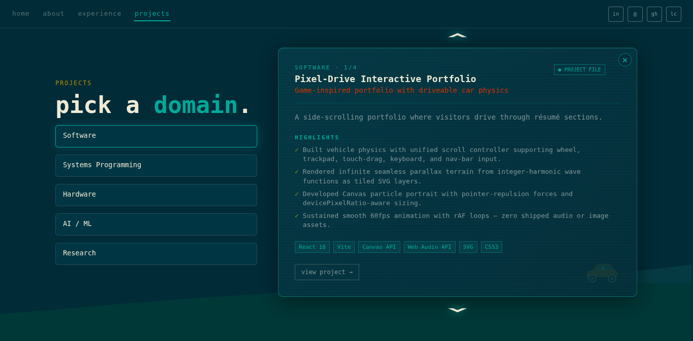

<p align="center">
Portfolio V1 is live <a href="https://portfolio-eta-eight-4e7wlc2x4d.vercel.app" target="_blank">here.</a> It is built with React 18 and Vite leveraging Canvas API, Web Audio API, SVG, CSS3.
</p>
<p align="center">
  
  
  
  

</p>

## 🛠 set-up

1. Install the dependencies

   ```sh
   npm install
   ```

2. Generate a build

   ```sh
   npm run build
   ```

3. Start the server

   ```sh
   npm run dev
   ```
